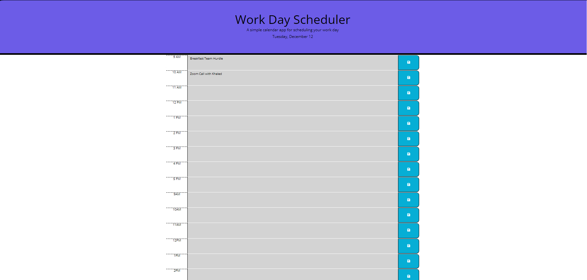

# Scheduler-App

A simple calendar app for scheduling your work day.

## Overview

This web application allows users to schedule their work day by entering events for each hour. The schedule is color-coded to indicate past, present, and future time blocks. Events are saved locally and persist between page refreshes.

## Features

- Display the current day at the top of the calendar.
- Timeblocks for standard business hours (9 AM to 5 PM).
- Color-coded timeblocks based on past, present, and future.
- Ability to enter events for each hour.
- Local storage to save and persist events.

## Technologies Used

- HTML
- CSS (Bootstrap for styling)
- JavaScript (jQuery, Day.js)

## Getting Started

1. Clone the repository to your local machine.
2. Open the `index.html` file in your web browser.

## Usage

- Enter your events in the respective time blocks.
- Click the "Save" button to save your events.
- Color-coded blocks will indicate past, present, and future times.

## Code Structure

- `index.html`: Main HTML file.
- `style.css`: Stylesheet for the application.
- `app.js`: JavaScript file containing the application logic.

## Dependencies

- [jQuery](https://jquery.com/)
- [Day.js](https://day.js.org/)

## Screenshot

## Contributing

Feel free to contribute to the development of this project. Fork the repository, make your changes, and submit a pull request.

## License

This project is licensed under the MIT License - see the [LICENSE](LICENSE) file for details.
